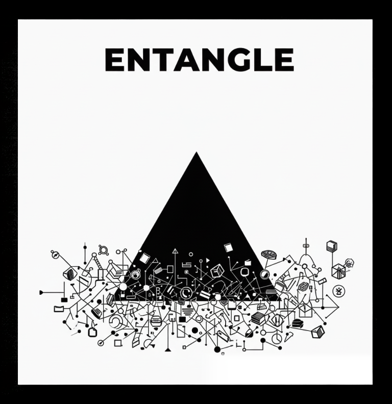

<picture>
  <source media="(prefers-color-scheme: dark)" srcset="images/LOGO_DARK.png">
  <source media="(prefers-color-scheme: light)" srcset="images/LOGO_LIGHT.png">
  
</picture>

# ENTANGLE by OPT-OUT
A lightweight ESP32 library for real-time hardware mirroring via ESP-NOW. It creates a low-latency "virtual wire" between two nodes, automatically syncing GPIO states and PWM values through a distributed bitmask. No network stack required—just seamless, symmetric state synchronization for instant peer-to-peer hardware entanglement
